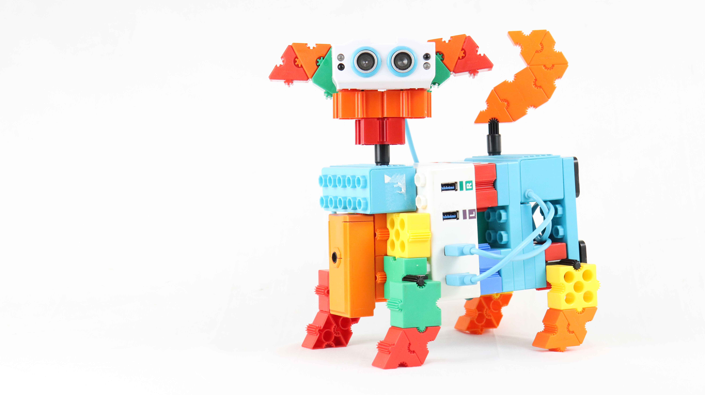

 AILite is a cutting-edge autonomous robot designed for a wide range of applications. With its sophisticated four-wheel drive system, integrated camera, ultrasonic sensors, IR sensor, color sensor, and touch sensor, AILite is capable of navigating complex environments with precision and intelligence. This versatile bot is perfect for tasks requiring advanced obstacle detection, machine learning applications, and real-time monitoring, making it an ideal solution for both educational and industrial purposes.MIT App Inventor is used for the execution of the projects.

## Get the Source Code
You can download the repository as a [zip file](https://github.com/marreddyanuhya/AILITE-MIT-APPLICATIONS/archive/refs/heads/main.zip) and extract it into a folder of your choice.

## Setting up the Local Connection
Enable Wi-Fi on your laptop, Pc or Mobile phone.
Turn on the AILite bot, which functions as a hotspot. 

### Connect to the network by entering the following details:
  -Wi-Fi Name: AILITE-<unique-ID> (e.g., AILITE-1069)
  
  -Wi-Fi Password: 123456789

## Accessing the Unique URL for each AILite Bot:
Open a web browser and enter the following URL to access the AILite bot:

URL format: 192.168.{bot_number}.10
Example: For AILITE-1069, the last two digits (69) are inverted to form the bot number (96), so the URL would be:
192.168.96.10

## Table of Contents
-[MIT App Inventor Installation](#MIT-App-Inventor-Installation)

-[MIT Projects Overview](#MIT-Projects-Overview)

## MIT App Inventor Installation
Here's a guide on how to install MIT App Inventor
### Installing MIT App Inventor
MIT App Inventor is a cloud-based tool that allows you to create Android apps using a visual programming interface.
Follow these steps to set up MIT App Inventor on your computer:

## Step 1: Set Up a Google Account
MIT App Inventor requires a Google account to log in and save your projects. 
If you don’t already have one, you can create a Google account at accounts.google.com/signup.

## Step 2: Access MIT App Inventor
Open your web browser (Chrome is recommended for the best experience).
Go to the MIT App Inventor website: appinventor.mit.edu.
Click on the “Create Apps!” button to be redirected to the App Inventor interface.
Log in using your Google account credentials.

## Step 3: Connect Your Android Device
To test your apps, you can connect your Android device in one of three ways:

### AI Companion App: 
The simplest method is to download the MIT AI2 Companion app from the Google Play Store on your Android device.
Open the app on your device.
In the MIT App Inventor interface, click “Connect” and select “AI Companion.”
Scan the QR code that appears on your computer screen with the AI2 Companion app.

### USB Connection:
Connect your Android device to your computer via USB.
Click on “Connect” and select “USB” in the MIT App Inventor interface.

### Emulator: 
If you don't have an Android device, you can use an Android emulator on your computer.
Click on “Connect” and select “Emulator.”

## Step 4: Start Creating Your App
Once connected, you can start building your app by dragging and dropping components in the Designer and programming their behavior in the Blocks Editor.

## MIT Projects Overview
### 1. Artist AILite
- **Objective**:The Artist AILite feature enables the system to recognize shapes such as straight lines or alphabets drawn by the user, and then replicate those shapes.
- **Sensor**: Phone Camera-Machine Learning
- **aia file**: [Artist AILite](https://github.com/robotixdevteam/AiLite/blob/MIT/Artist%20AI%20Lite.aia)
### 2. Button control-L1(Level 1)
- **Objective**: In the button control feature, clicking the Start Button activates forward motor movement, while clicking the Stop Button halts motor operation.
- **aia file**:[Button control-L1(Level 1)](https://github.com/robotixdevteam/AiLite/blob/MIT/Button%20Control%20-%20L1.aia)

### 3. Button control-L2 (Level 2)
- **Objective**:	It Use buttons to control AiLite's movements.
- **aia file**:[Button control-L2 (Level 2))](https://github.com/robotixdevteam/AiLite/blob/MIT/Button%20Control%20-%20L2.aia)
### 4. Chatbot 
- **Objective**: It performs operations based on yes/no questions, providing responses accordingly.
- **Sensor**: Phone's Mic - Text to Speech & Speech Recognition
- **aia file**:[Chatbot](https://github.com/robotixdevteam/AiLite/blob/MIT/Chat%20Bot%20AI%20Lite.aia)
### 5. Emotion Recognition-L1	
- **Objective**: The emotion recognition feature detects whether the user is happy or angry. If the user is happy, AILite initiates a dance, whereas if the user is angry, AILite moves away from the user.
- **Sensor**: Phone Camera - Machine Learning
- **aia file**:[Emotion Recognition-L1](https://github.com/robotixdevteam/AiLite/blob/MIT/Emotion%20Recognition.aia)

### 6. Face detection
- **Objective**:By using Personal Image Classifier it enables AILite to dance when a face is detected through camera, and spin around when no face is detected.
- **Sensor**: Phone Camera - Machine Learning
- **aia file**:[Face detection](https://github.com/robotixdevteam/AiLite/blob/MIT/Face%20Detection.aia)
### 7.	Face Recognition-Hi user
- **Objective**:	AILite detects its user and say "Hi User" and do some actions, if not its user it say "you are not my user" and go away.
- **Sensor**: Phone Camera - Machine Learning
- **aia file**:[Face Recognition-Hi user](https://github.com/robotixdevteam/AiLite/blob/MIT/Face%20Recognition%20-%20Hi%20User.aia)
### 8.	Hand Gestures 
- **Objective**: Open and close hand	By recognizing hand gestures, AiLite performs predefined actions, using personal image classifier
- **Sensor**: Phone Camera - Machine Learning**
- **aia file**:[Hand Gestures](https://github.com/robotixdevteam/AiLite/blob/MIT/Hand%20Gestures.aia)
### 9.	Light sensor control
- **Objective**: This makes the bot move forward in the presence of light and halt when there is no light.
- **Sensor**: Phone LDR Sensor
- **aia file**:[Light sensor control](https://github.com/robotixdevteam/AiLite/blob/MIT/Light%20Sensor%20AI%20Lite.aia)
### 10.	Object Follower-US
- **Objective**: It uses Ultrasonic sensor to detect the objects and follows the Object.
- **Sensor**: Bot's Ultrasonic Sensor
- **aia file**:[Object Follower-US](https://github.com/robotixdevteam/AiLite/blob/MIT/Object%20Follower%20-%20US.aia)
### 11.	Obstacle Avoider-IR
- **Objective**: It Include TTS(Test to Speech) It uses IR sensor values to detect and avoid obstacles in front of it, and informs the user if an obstacle is present.
- **Sensor**: Bot's IR Sensor
- **aia file**:[Obstacle Avoider-IR](https://github.com/robotixdevteam/AiLite/blob/MIT/Obstacle%20Avoider-IR.aia)
### 12.	OCR App
- **Objective**: Speed control	It Recognizes characters and adjust the speed of AILite accordingly.
-**Sensor**: Phone Camera - Text Recognition
- **aia file**:[OCR App](https://github.com/robotixdevteam/AiLite/blob/MIT/Ocr%20App.aia)
### 13.	Orientation Sensor-Compass
- **Objective**: This uses compass directions to guide AiLite in performing specific actions based on its orientation.
- **Sensor**: Phone Accelerometer
- **aia file**:[Orientation Sensor](https://github.com/robotixdevteam/AiLite/blob/MIT/Orientation%20Sensor%20-%20Compass.aia)
### 14.	Remote Surviellance
- **Objective**: The user initiates remote surveillance using buttons for "forward," "backward," "left," and "right." The ESP32 camera streams the footage, enabling control of the bot's movements forward and backward.
- **Sensor**: Bot Camera
- **aia file**:[Remote Surviellance](https://github.com/robotixdevteam/AiLite/blob/MIT/Remote%20Surviellance.aia)
### 15.	Specs Recognition
- **Objective**: AILite  recognizes the specs and do some actions by using Teachable Machines.
- **Sensor**: Phone Camera - Machine Learning
- **aia file**:[Specs Recognition](https://github.com/robotixdevteam/AiLite/blob/MIT/Specs%20Recognition.aia)
### 16.	Speech control AILite-L1 (Level 1)
- **Objective**: In Speech Control, users can prompt AILite to "start moving" to initiate motion and "stop moving" to halt it, facilitating seamless interaction.
- **Sensor**: Phone's Mic
- **aia file**:[Speech control AILite-L1](https://github.com/robotixdevteam/AiLite/blob/MIT/Speech%20Control%20AI%20Lite%20-%20L1.aia)
### 17.	Speech control AILite-L2 (Level 2)
- **Objective**:	The user gives voice commands like "move forward," "move backward," and more, which AiLite processes to perform the corresponding actions.
- **Sensor**: Phone's Mic
- **aia file**:[Speech control AILite-L2](https://github.com/robotixdevteam/AiLite/blob/MIT/Speech%20Control%20AI%20Lite%20-%20L2.aia)
### 18.	Speed Control Ailite
- **Objective**:AILite adjusts between low, medium, and high speeds through button controls.
- **aia file**:[Speed Control Ailite](https://github.com/robotixdevteam/AiLite/blob/MIT/Speed_Control.aia)
### 19. Swipe 	Gesture Control
- **Objective**:	It utilizes swipe gestures for movement control.
- **Sensor**: Phone's Touch Control
- **aia file**:[Gesture Control](https://github.com/robotixdevteam/AiLite/blob/MIT/Swipe%20Gesture%20Control.aia)
### 20.	Tilt Control AILite-L1 (Level 1)
- **Objective**: This enables the bot to turn left when the phone is tilted left and turn right when the phone is tilted right.
- **Sensor**: Phone Accelerometer
- **aia file**:[Tilt Control AILite-L1](https://github.com/robotixdevteam/AiLite/blob/MIT/Tilt%20Control%20AI%20Lite%20-%20L1.aia)
### 21.	Tilt control AILite-L2 (Level 2)
- **Objective**:The user tilts the device forward for forward movement, backward for backward movement, and more, AILite implements the actions accordingly.
- **Sensor**: Phone Accelerometer
- **aia file**:[Tilt control AILite-L2](https://github.com/robotixdevteam/AiLite/blob/MIT/Tilt%20Control%20AI%20Lite%20-%20L2.aia)
### 22.	Traffic sign Detection
- **Objective**: Using personal Image classifier, AiLite adjusts its movements based on recognized traffic signs.
- **Sensor**: Phone Camera - Machine Learning
- **aia file**:[Traffic sign Detection](https://github.com/robotixdevteam/AiLite/blob/MIT/Traffic%20Sign%20Detection.aia)
### 23.	WorkoutBuddy-Pedometer
- **Objective**: The pedometer feature enables AILite to follow the user's walking motion; when the user starts walking, AILite initiates movement, and when the user stops, AILite halts as well. Additionally, it tracks the number of steps taken, distance covered, and elapsed time during the activity.
- **Sensor**: Phone Accelerometer
- **aia file**:[WorkoutBuddy-Pedometer](https://github.com/robotixdevteam/AiLite/blob/MIT/Workout%20Buddy%20-%20Pedometer.aia)
### 24. Action Gen AI
- **Objective**:Users can control Ailite Neo by giving commands such as move forward, move backward, and other actions, effectively providing it with a brain and sensor-based control system.
- **aia file**:[Action Gen AI](https://github.com/robotixdevteam/AiLite_Neo/blob/MIT/Action_Gen_AI.aia)
### 25. Characters
- **Objective**: This features three characters—Owl, Crab, and Bat—each with a unique personality: Mentor, Teacher, and Friend. Users can interact with these characters to ask questions and engagingly learn STEM subjects.
- **aia file**:[Characters](https://github.com/robotixdevteam/AiLite_Neo/blob/MIT/Characters.aia)
### 26. Conversational ChatBots
- **Objective**:Users can interact with the LLM through a chat interface, where the conversation history is saved for each session.
- **aia file**:[Conversational ChatBot](https://github.com/robotixdevteam/AiLite_Neo/blob/MIT/Conversational_chatbot.aia).
### 27. Conversational ChatBot KB
- **Objective**: Users can upload their own knowledge base to the LLM and perform tasks such as question-and-answer sessions and summarization using their data.
- **aia file**:[Conversational ChatBot KB](https://github.com/robotixdevteam/AiLite_Neo/blob/MIT/Conversational_chatbot_KB.aia).
### 28. Shapes
- **Objective**: This application has two modes. In the first mode, users can draw predefined shapes such as circles, squares, and triangles. In the second mode, users can draw shapes freely using button controls, and our AI model analyzes the drawing to identify the shape.
- **aia file**:[Shapes](https://github.com/robotixdevteam/AiLite_Neo/blob/MIT/shapes.aia).
### 29. Text Gen AI
- **Objective**:In this program, users can enter their queries as text input and receive relevant text-based responses. We have used OpenAI as the large language model (LLM) to generate the outputs.
- **aia file**:[Text Gen AI](https://github.com/robotixdevteam/AiLite_Neo/blob/MIT/Text_Gen_AI.aia).
### 30. yes no neo 
- **Objective**:Ailite Neo asks questions to the user and performs actions based on the user’s response. If the response is correct, it rotates its tail; if the response is incorrect, it rotates its head.
- **aia file**:[yes no neo](https://github.com/robotixdevteam/AiLite_Neo/blob/MIT/yes_no_neo.aia).
  
## Types of construction
### 2-Wheel Construction

The 2-wheel construction is a popular and widely used design in AILite projects. It is favored for its simplicity, agility, and versatility, making it suitable for a broad range of applications. This design features two wheels driven by motors, allowing for straightforward movement and maneuverability. The 2-wheel version is especially well-suited for projects that require quick directional changes, precise navigation, and efficient use of space.

Key Features:
Versatility: The 2-wheel construction can be applied to a wide variety of projects, ranging from basic robotics to more complex automation tasks.
Agility: With only two wheels, this design allows for easy turning and swift movement, making it ideal for navigating tight spaces and performing tasks that require quick adjustments.
Simplicity: The design is simple, making it easier to build, maintain, and modify for different project needs.

### 4-Wheel Construction

The 4-wheel construction in AILite provides a more stable and robust platform, which is particularly advisable for projects involving color sensors and other sensor-based applications. While the same projects that can be performed with the 2-wheel version can also be executed with the 4-wheel version, the latter offers added stability and support, which is crucial for certain types of sensor-based tasks.

Key Features:
Stability: The 4-wheel design offers greater stability, reducing the risk of tipping or imbalance, especially when navigating uneven terrain or carrying additional sensors and equipment.
Enhanced Sensor Performance: For color sensor-based projects, the 4-wheel construction provides a steadier platform, ensuring more accurate sensor readings and reliable performance.
Adaptability: Although more complex than the 2-wheel version, the 4-wheel construction can handle the same range of projects, with the added benefit of increased stability and sensor integration.

## Various Execution Options for AILite

In addition to MIT App Inventor, AILite projects can also be developed using Python, a powerful and user-friendly platform for creating mobile applications. MIT App Inventor allows users to design and implement projects through a visual programming interface, making it accessible to those who may not be familiar with traditional coding. Kindly refer the following link for more information.

## Contact

- Contact us via [Email](mailto:development@merituseducation.com)

